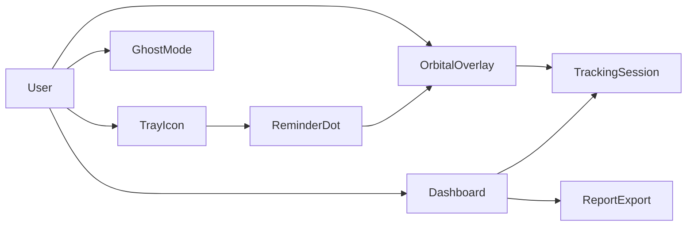
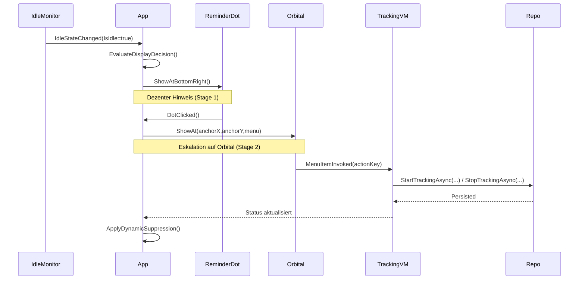
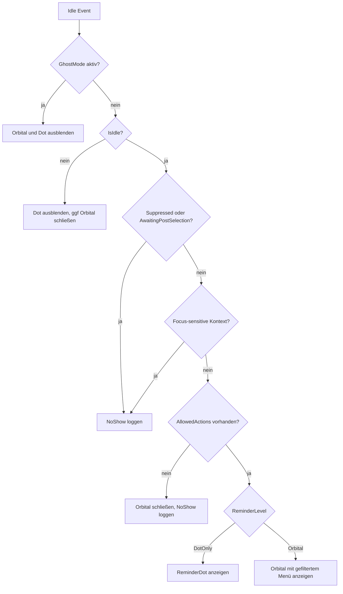
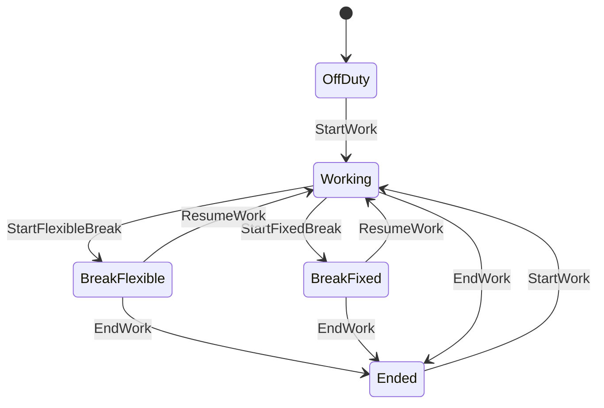

# FlowTracker

FlowTracker ist ein lokaler, tray-basierter Time-Tracker für Windows mit Fokus auf **schnelle Erfassung**, **klare Regeln** und **möglichst wenig Unterbrechung im Arbeitsfluss**.

Die Anwendung läuft ohne Cloud-Zwang: Daten bleiben lokal in SQLite.

## Highlights

- Tray-only UX: kein aufdringliches Hauptfenster im Alltag
- Adaptive Eingabehilfe:
  - dezenter Reminder-Dot
  - Orbital-Menü bei Bedarf (stufige Eskalation)
- Zustandsbasierte Regeln für chronologische Zeiterfassung
- Dashboard mit Chronik, KPI-Karten und Tages-/Wochen-/Monats-/Jahresansicht
- CSV- und PDF-Export
- Lokale Datenhaltung (`%LocalAppData%/FlowTracker/flowtracker.db`)

## Tech Stack

- .NET 10 (`net10.0-windows`)
- WPF
- C# (modernes Sprachlevel)
- SQLite (`Microsoft.Data.Sqlite`)
- Dapper
- QuestPDF
- Windows Interop (P/Invoke)

## Architekturüberblick

- `App.xaml.cs`: Startup, Tray-Orchestrierung, Idle-/Reminder-Policy
- `Services/IdleMonitorService.cs`: Idle- und Maus-Signale
- `Services/WorkStateMachine.cs`: erlaubte Aktionen und Übergänge
- `ViewModels/*`: MVVM-Logik für Tracking und Dashboard
- `Repositories/*`: SQLite-Zugriff via Dapper
- `Views/*`: Orbital, Dashboard, Flyout, Reminder-Dot

## Diagramme

### Use Case



### Sequence: Idle Reminder zu Tracking-Aktion



### Flowchart: Anzeigeentscheidung Reminder/Orbital



### State: Zeiterfassung



## Voraussetzungen

- Windows 10/11
- .NET SDK 10.x

Prüfen:

```powershell
dotnet --info
```

## Quick Start

```powershell
dotnet restore "FlowTracker.slnx"
dotnet build "FlowTracker.slnx" -c Debug
dotnet run --project "FlowTracker.csproj" -c Debug
```

Erwartetes Verhalten:

- App startet im Tray
- Linksklick öffnet Flyout
- Rechtsklick öffnet Kontextmenü

## Build & Publish

Debug Build:

```powershell
dotnet build "FlowTracker.slnx" -c Debug
```

Release Build:

```powershell
dotnet build "FlowTracker.slnx" -c Release
```

Publish (framework-dependent):

```powershell
dotnet publish "FlowTracker.csproj" -c Release -r win-x64 --self-contained false
```

Output:
`bin/Release/net10.0-windows/win-x64/publish`

## Reminder-Profile

FlowTracker unterstützt drei Reminder-Profile:

- `quiet`: zurückhaltend, längere Schwellen/Cooldowns
- `balanced`: Standardprofil
- `strict`: frühere und häufigere Erinnerung

Steuerung per Umgebungsvariable:

```powershell
$env:FLOWTRACKER_REMINDER_PROFILE = "quiet"
dotnet run --project "FlowTracker.csproj" -c Debug
```

## UX: Orbital + Dot + Fokuskontext

Die Reminder-Logik arbeitet in Stufen:

1. Dot als ruhiger Hinweis
2. Orbital-Einblendung bei notwendiger Aktion
3. adaptive Suppression bei häufigen schnellen Dismisses

Zusätzlich ist eine erste Focus-Awareness integriert:

- Unterdrückung bei Vollbild-Fenstern
- Unterdrückung bei fokussensitiven Prozessen (z. B. IDE/Office/Meeting-Apps)

## Regelwerk der Zeiterfassung

Die Erfassung wird über einen Zustandsautomaten geführt:

- `OffDuty -> Working -> Break -> Working -> Ended`
- Aktionen sind zustandsabhängig freigegeben
- Ungültige Aktionen liefern konkrete Hinweise
- Feste Pause hat Mindestdauer vor `ResumeWork`
- Status wird aus Tagesdaten robust rekonstruiert

## Dashboard & Reporting

- Editierbare Chronik (Start, Ende, Kategorie, Beschreibung)
- KPI-Karten für Soll/Ist, Über-/Fehlstunden
- Tägliche Saldo-Chronik mit kumuliertem Verlauf
- Export:
  - CSV
  - PDF (inkl. Summary-Werten)

## Tray-Icons

- Icons liegen unter `Icons/`
- Zuordnung nach Status/Kontext (mit Fallbacks)
- Kein unsichtbares Standard-Icon im Normalbetrieb

## Logging & Stabilität

- Dateilogs: `%LocalAppData%/FlowTracker/logs/app.log`
- Globale Exception-Handler:
  - `DispatcherUnhandledException`
  - `AppDomain.CurrentDomain.UnhandledException`
  - `TaskScheduler.UnobservedTaskException`
- Orbital-Telemetrie:
  - Show/Hide-Gründe
  - Sichtdauer
  - Quick-Dismiss-Streak

## Datenschutz

- Ausschließlich lokale Datenspeicherung
- Kein geplanter Netzwerkversand von Trackingdaten

## Tests

```powershell
dotnet test "FlowTracker.slnx" -c Debug
```

## Roadmap (kurz)

- Feingranulare User-Settings für Icon-/Reminder-Mapping
- Erweiterte Focus-Erkennung (App-Klassen, Szenarien)
- Weitere Tests für Reminder-Policy und Suppression-Heuristiken

## Mitwirken

Issues, Vorschläge und Verbesserungen sind willkommen.

Bei größeren Änderungen bitte:

1. eigenes Branching nutzen
2. Build + Tests lokal ausführen
3. nachvollziehbare Commit-Messages verwenden
